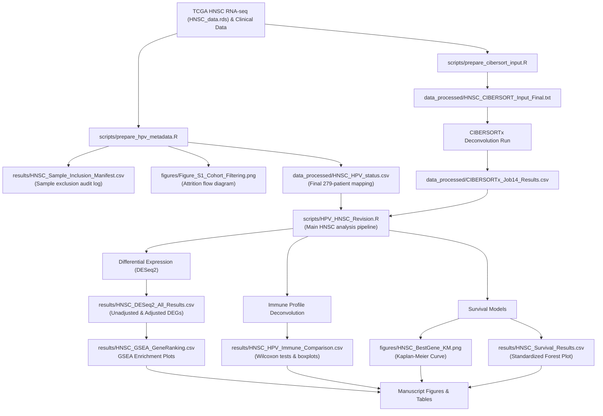

# Transcriptomic and Immune Profiling of HPV-Positive vs. HPV-Negative HNSC

## Immune Microenvironment Remodeling and Transcriptomic Divergence in HPV-Positive versus HPV-Negative Head and Neck Squamous Cell Carcinoma: A TCGA-Based Bioinformatics Analysis

---

## Overview

This repository contains the complete bioinformatics workflow, processed datasets, analysis scripts, result tables, figures, supplementary materials, and manuscript files for the study:

**"Immune Microenvironment Remodeling and Transcriptomic Divergence in HPV-Positive versus HPV-Negative Head and Neck Squamous Cell Carcinoma: A TCGA-Based Bioinformatics Analysis."**

The study investigates transcriptomic and immune microenvironment differences between HPV-positive and HPV-negative Head and Neck Squamous Cell Carcinoma (HNSC) using publicly available data from The Cancer Genome Atlas (TCGA).

The analyses include:

- Differential gene expression analysis (DESeq2)
- Immune-cell deconvolution (CIBERSORTx)
- Gene Ontology (GO) enrichment analysis
- KEGG pathway enrichment analysis
- Gene Set Enrichment Analysis (GSEA)
- Survival analysis using Kaplan–Meier and Cox proportional hazards models
- Validation of immune-cell estimates using canonical marker genes

This repository is organized to enable complete reproducibility and facilitate future extension of the work by other researchers and students.

---

# Analysis Workflow

The repository implements a structured bioinformatic pipeline leading from raw TCGA-HNSC datasets to publication-ready figures and tables.



### Execution Sequence

To replicate the HNSC cohort selection and analysis:

1. **Step 1 (Cohort Definition)**: Run [scripts/prepare_hpv_metadata.R](file:///c:/Users/rejoy/Documents/Intern_Project/scripts/prepare_hpv_metadata.R) to process clinical patient files, filter to primary solid tumors (`Sample Type Code 01`), exclude normal controls (`Sample Type Code 11`), and output the final deconvolution clinical mapping to `data_processed/HNSC_HPV_status.csv`.
2. **Step 2 (Deconvolution Matrix Prep)**: Run [scripts/prepare_cibersort_input.R](file:///c:/Users/rejoy/Documents/Intern_Project/scripts/prepare_cibersort_input.R) to convert raw count expressions into a canonical TPM mixture matrix matching the deconvolution panel at `data_processed/HNSC_CIBERSORT_Input_Final.txt`.
3. **Step 3 (CIBERSORTx Deconvolution)**: Upload the mixture matrix to [CIBERSORTx](https://cibersortx.stanford.edu/) under the study parameters (LM22 signature matrix, relative mode, 100 permutations, disabled QN, no batch correction) and download the results as `data_processed/CIBERSORTx_Job14_Results.csv`.
4. **Step 4 (Main Analysis Pipeline)**: Run [scripts/HPV_HNSC_Revision.R](file:///c:/Users/rejoy/Documents/Intern_Project/scripts/HPV_HNSC_Revision.R) to perform unadjusted and covariate-adjusted differential expression, functional GO/KEGG pathway enrichments, gene set enrichment analyses (GSEA), immune-cell fraction Wilcoxon comparison testing, deconvolution validation correlations, and prognostic overall survival Cox/Kaplan-Meier modelling.

---

# Key Findings

## Enhanced Adaptive Immune Activation

HPV-positive tumors demonstrated significantly increased infiltration of adaptive immune cells, particularly:

- Plasma cells
- CD8+ T cells

Independent validation using established marker genes supported these findings:

### Plasma-cell markers

- IGKC
- IGHA1
- IGHM
- MS4A1 (CD20)
- CD79A
- CD79B

### CD8 T-cell markers

- CD8A
- CD8B

These observations are consistent with an immune-active tumor microenvironment in HPV-positive disease.

---

## Myeloid Compartment Remodeling

HPV-negative tumors exhibited significantly increased fractions of:

- M0 macrophages

These cells are interpreted cautiously as unpolarized macrophage-like cells rather than inherently immunosuppressive macrophages.

---

## Suppression of Keratinization Programs

HPV-positive tumors showed strong downregulation of genes involved in:

- Keratinization
- Cornification
- Epithelial differentiation

Representative genes include:

- S100A7
- SPRR family genes
- LCE family genes
- DSC1
- KRT1
- KRT6
- KRT10
- KRT14

These findings are consistent with the non-keratinizing phenotype commonly observed in HPV-associated oropharyngeal carcinoma.

---

## Prognostic Gene Discovery

Standardized Cox proportional hazards models identified several genes associated with overall survival, including:

- ZFR2
- STAG3
- SMC1B
- RAD9B

These findings are exploratory and require validation in independent cohorts.

---

# Repository Structure

```text
TCGA-HNSC-HPV-Transcriptomics/
│
├── data_raw/
├── data_processed/
├── scripts/
├── results/
├── figures/
├── supplementary/
│   ├── figures/
│   └── tables/
├── manuscript/
├── documentation/
├── README.md
└── sessionInfo.txt
```

---

# Directory Description

## data_raw/

Contains original downloaded files and metadata.

Examples:

- MANIFEST.txt
- data_clinical_patient.txt
- data_clinical_patient_full.txt
- data_clinical_patient_pub.txt
- data_clinical_sample.txt
- hnsc_tcga_pub_clinical_data.tsv

Large raw expression datasets are not included because of GitHub storage limitations.

---

## data_processed/

Contains cleaned datasets and intermediate analysis files.

Examples:

- HNSC_HPV_status.csv
- CIBERSORTx_Job3_Results.csv
- CIBERSORTx_Job4_Results.csv
- CIBERSORTx_Job7_Results.csv
- CIBERSORTx_Job8_Results.csv
- CIBERSORTx_Job14_Results.csv
- HNSC_CIBERSORT_Input_Final.txt

---

## scripts/

Contains all R and Python scripts used throughout the project.

Examples:

- HPV_HNSC_Revision.R
- CESC_DESeq.R
- analyze_hpv.py
- calculate_demographics.py
- check_studies.py
- copy_images.py
- download_data.py
- fetch_cbioportal.py
- generate_docx.py
- plot_immune_summary.py
- plot_workflow.py
- recalculate_all.py

---

## results/

Contains generated output tables.

### Differential Expression

- HNSC_DESeq2_All_Results.csv
- HNSC_HPV_DEGs.csv
- HNSC_HPV_DEGs_significant.csv

### Enrichment Analyses

- HNSC_HPV_GO_Enrichment.csv
- HNSC_HPV_KEGG_Enrichment.csv
- HNSC_HPV_GSEA.csv

### Immune Analyses

- HNSC_HPV_Immune_Comparison.csv
- HNSC_HPV_Significant_Immune_Cells.csv
- Plasma_Cell_Validation_Correlations.csv

### Survival Analyses

- HNSC_Survival_Results.csv
- HNSC_Standardized_Cox_Results.csv
- Table_Survival_Genes.csv

---

## figures/

Contains publication-quality figures used in the main manuscript.

Examples:

- Figure_1_Workflow.png
- Figure1_PCA.png
- Figure2_Volcano.png
- Figure8_Immune_Heatmap.png
- HNSC_Forest_Plot.png
- HNSC_BestGene_KM.png

Both PNG and PDF formats are included when available.

---

## supplementary/

### supplementary/figures/

Contains supplementary figures and validation analyses.

Includes:

- Supplementary_Figure_S1_PCA
- Supplementary_Figure_S1A_Raw_PCA
- Supplementary_Figure_S2_Immune_Heatmap
- Supplementary_Figure_S3_CD8_Validation
- Supplementary_Figure_S4_PrimarySite_Adjusted
- Supplementary_Figure_S5_GO_Enrichment
- Supplementary_Figure_S6_KEGG_Enrichment
- Supplementary_Figure_S7_GSEA
- Supplementary_Figure_S8_Sensitivity_Analysis
- Supplementary_Figure_S9_PlasmaCell_Validation
- Supplementary_Figure_S10_Kaplan_Meier
- Supplementary_Figure_S11_ForestPlot

Additional plasma-cell marker validation plots:

- Validation_CD79A_PlasmaCells
- Validation_CD79B_PlasmaCells
- Validation_IGKC_PlasmaCells
- Validation_IGHA1_PlasmaCells
- Validation_IGHM_PlasmaCells
- Validation_MS4A1_PlasmaCells

---

### supplementary/tables/

Contains supplementary data tables.

Includes:

- Supplementary_Table_S1
- Supplementary_Table_S2
- Supplementary_Table_S3
- Supplementary_Table_S4
- Supplementary_Table_S5
- Supplementary_Table_S6
- Supplementary_Table_S7
- Supplementary_Table_S8
- Supplementary_Table_S9
- Supplementary_Table_S10
- Supplementary_Table_S11
- Supplementary_Table_S12
- Supplementary_Table_S13
- Supplementary_Table_S14
- Supplementary_Table_S15
- Supplementary_Table_S16

---

## manuscript/

Contains manuscript and project documentation.

Files include:

- final-report.docx
- Supplementary_Materials.docx

---

## documentation/

Contains:

- sessionInfo.txt
- code.docx
- Selected_Genes_for_Literature_Review.csv
- Literature_Review_Template.csv

---

# Data Acquisition

## Clinical Data

Clinical information can be downloaded directly from cBioPortal.

```bash
python scripts/download_data.py
```

or

```bash
python scripts/fetch_cbioportal.py
```

Generated files:

- data_clinical_patient.txt
- data_clinical_sample.txt
- data_clinical_patient_full.txt
- data_clinical_patient_pub.txt

---

## TCGA RNA-Seq Data

Raw expression data were obtained from:

https://portal.gdc.cancer.gov/projects/TCGA-HNSC

### Using TCGAbiolinks

```r
library(TCGAbiolinks)

query <- GDCquery(
  project = "TCGA-HNSC",
  data.category = "Transcriptome Profiling",
  data.type = "Gene Expression Quantification",
  workflow.type = "STAR - Counts"
)

GDCdownload(query)
data <- GDCprepare(query)

saveRDS(data, "data_raw/HNSC_data.rds")
```

---

# Reproducibility Guide

Run the analysis in the following order.

## Step 1 – Download and Prepare Clinical Data

```bash
python scripts/download_data.py
python scripts/calculate_demographics.py
```

Purpose:

- Download clinical metadata
- Generate demographic summaries
- Produce Table 1 statistics

---

## Step 2 – Obtain CIBERSORTx Immune Estimates

1. Generate expression matrix.
2. Upload matrix to CIBERSORTx.
3. Use:

- Signature Matrix: LM22
- Permutations: 1000
- Absolute Mode: Disabled

Output:

- CIBERSORTx_Job14_Results.csv

stored in:

```text
data_processed/
```

---

## Step 3 – Differential Expression Analysis

```r
source("scripts/HPV_HNSC_Revision.R")
```

Purpose:

- DESeq2 analysis
- HPV-positive vs HPV-negative comparison
- Primary-site sensitivity analysis

Outputs:

- HNSC_DESeq2_All_Results.csv
- HNSC_HPV_DEGs.csv
- HNSC_HPV_DEGs_significant.csv

---

## Step 4 – Immune Validation Analyses

```bash
python scripts/analyze_hpv.py
```

Purpose:

- Validate CD8 T-cell estimates
- Validate plasma-cell estimates

Outputs:

- Plasma_Cell_Validation_Correlations.csv
- Supplementary validation tables

---

## Step 5 – Functional Enrichment

```r
source("scripts/HPV_HNSC_Revision.R")
```

Generates:

- HNSC_HPV_GO_Enrichment.csv
- HNSC_HPV_KEGG_Enrichment.csv
- HNSC_HPV_GSEA.csv

---

## Step 6 – Survival Analysis

```r
source("scripts/HPV_HNSC_Revision.R")
```

Outputs:

- HNSC_Survival_Results.csv
- HNSC_Standardized_Cox_Results.csv

---

## Step 7 – Generate Figures

Workflow figure:

```bash
python scripts/plot_workflow.py
```

Immune summary figure:

```bash
python scripts/plot_immune_summary.py
```

Copy figures:

```bash
python scripts/copy_images.py
```

Outputs:

- figures/
- supplementary/figures/

---

## Step 8 – Compile Manuscript

```bash
python scripts/generate_docx.py
```

Output:

- manuscript/Immune_Landscape_HNSC.docx

If the document is open and locked:

- Immune_Landscape_HNSC_Updated.docx

will be generated automatically.

---

# Software Environment

## R Packages

- DESeq2
- TCGAbiolinks
- clusterProfiler
- EnhancedVolcano
- survival
- survminer
- ggplot2
- pheatmap
- dplyr

Full package versions are listed in:

```text
documentation/sessionInfo.txt
```

---

## Python Dependencies

```bash
pip install numpy pandas scipy matplotlib seaborn python-docx beautifulsoup4
```

---

# Expected Outputs

Running the pipeline should reproduce:

### Main Manuscript Figures

- Workflow diagram
- PCA
- Volcano plot
- Immune infiltration comparison
- Immune heatmap
- GO enrichment
- KEGG enrichment
- GSEA
- Forest plot
- Kaplan–Meier plot

### Supplementary Figures

- 11 supplementary figures
- Plasma-cell validation plots

### Supplementary Tables

- 16 supplementary tables

### Manuscript Files

- Main manuscript
- Supplementary materials
- Response to reviewers

---

# Citation

If you use this repository, please cite:

> Besra R. et al. Transcriptomic and Immune Profiling of HPV-Positive versus HPV-Negative Head and Neck Squamous Cell Carcinoma. Research Internship Project, 2026.

---

# Author

**Rejoy Besra**  
Department of Bioscience and Biotechnology  
Indian Institute of Technology Kharagpur

GitHub: https://github.com/rejoy2004-rgb

---

# Reproducibility and GSEA Parameters

All analyses were performed using publicly available TCGA-HNSC datasets. The repository is configured to guarantee strict reproducibility.

Immune deconvolution was performed externally using the CIBERSORTx web server (LM22 signature matrix, relative mode, 100 permutations, QN disabled, no batch correction). The repository includes both the exact input matrix (`data_processed/HNSC_CIBERSORT_Input_Final.txt`) and the archived output (`data_processed/CIBERSORTx_Job14_Results.csv`), together with the documented execution parameters in `documentation/CIBERSORTx_Provenance.md`.

*Note: The archived Job14 results are the canonical results used for the manuscript. Re-running the workflow using the external CIBERSORTx web portal may produce small numerical differences due to updates in the external web service, annotation databases, or Monte Carlo permutation seed differences.*

General parameters and reproducibility settings include:

- **Cohort Verification**: The HNSC pipeline verifies that the processed dataset contains exactly **243 HPV-negative** and **36 HPV-positive** samples, raising an error if any data update alters this cohort. A full filtering funnel is saved in `results/HNSC_Cohort_Manifest.csv`, and all final patient barcodes are saved in `results/HNSC_Final_Cohort.csv`.
- **GSEA Ranking Metric**: Genes are ranked using the **DESeq2 Wald statistic**, emphasizing statistical evidence of differential expression between HPV-positive and HPV-negative groups.
- **Ensembl Duplicate Resolution**: Multiple Ensembl transcript entries mapping to the same gene are collapsed by retaining the **maximum Wald statistic**.
- **GSEA Execution Parameters**:
  - **Ontology**: GO Biological Process (BP)
  - **Exponent**: 1.0 (standard weighted ranking)
  - **Min Gene Set Size (`minGSSize`)**: 10
  - **Max Gene Set Size (`maxGSSize`)**: 500
  - **Multiple-Testing Correction**: Benjamini-Hochberg (BH)
  - **FDR Cutoff**: 0.25 (exploratory threshold recommended by the Broad Institute for GSEA)
  - **Random Seed**: `123` (set before GSEA to maximize reproducibility across repeated executions)

GSEA software and library version numbers are logged dynamically to `results/HNSC_GSEA_package_versions.txt` upon execution.
